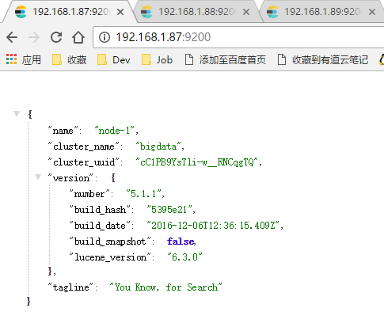

## 安装前

* **机器列表**

```
192.168.1.87 base1
192.168.1.88 base2
192.168.1.89 base3

所有的机器都要有java 1.8 环境，因为ES 5.0 依赖于JDK1.8
```

* **软件下载**

> [软件下载](https://www.elastic.co/downloads/elasticsearch) 下载 elasticsearch-5.1.1.tar.gz 到 /root 目录下

**以下操作都必须在所有节点上进行配置**

* **创建用户**

由于ES不能安装在root用户下，必须要安装在普通用户下，此处选择了已经存在的用户：`spark`，当然也可以创建新用户

* **修改系统参数**

解决：`max file descriptors [4096] for elasticsearch process likely too low, increase to at least [65536]` 问题

```
$ vim /etc/security/limits.conf

# 在文件末尾添加如下配置
* hard nofile 65536
* soft nofile 65536
```

解决：`max virtual memory areas vm.max_map_count [65530] likely too low, increase to at least [262144]` 问题

```
$ sudo sysctl -w vm.max_map_count=655360
$ sysctl -a
```

解决：`max size virtual memory [15214755840] for user [base1] is too low, increase to [unlimited]` 问题
```
$ sudo ulimit -v unlimited
```

## 安装配置

* **解压软件包**

```
$ cd /root
$ tar -zxf elasticsearch-5.1.1.tar.gz -C /home/spark
$ mv /home/spark/elasticsearch-5.1.1 /home/spark/elasticsearch
$ chown -R spark:spark elasticsearch
$ su - spark
[spark@base1 ~]$ ll
total 4
drwxr-xr-x 9 spark spark 145 Jan 12 10:37 elasticsearch
```

* **配置**

`vim config/elasticsearch.yml`

需要配置的有以下几项

```
cluster.name: bigdata # 所有节点的集群名称要相同
node.name: node-1 # 所有节点的node名称要唯一
node.master: true # 增加配置，是否可以做为Master节点
node.data: true # 增加配置，是否可以做为Data节点
network.host: base1 # 配置该节点网络host
discovery.zen.ping.unicast.hosts: ["base1", "base2", "base3"] # 配置广播节点
discovery.zen.minimum_master_nodes: 3 # 最小发现节点数
# 增加配置，这样head插件可以访问ES
http.cors.enabled: true
http.cors.allow-origin: "*"
```
由于没有配置数据目录和日志目录，所以数据和日志会默认在 `/home/spark/elasticsearch` 的 `data` 和 `logs` 目录

如果需要配置，给出以下事例：

```
# 配置数据目录
path.data: /data/es/data
# 配置日志目录
path.logs: /data/es/logs
```

* **分发到其他节点并修改配置**

在另外两个节点上需要修改的配置为

`vim config/elasticsearch.yml`

```
node.name: node-2 # 所有节点的node名称要唯一
network.host: base2 # 配置该节点网络host
```

## 启动集群

* **依次启动所有节点**

依次启动所有节点，ES集群会自动选取Master节点，不需要借助ZK

```
$ ./bin/elasticsearch -d # 后台启动方式
```

查看启动状态：




**使用ES可以用REST方式，但是毕竟不太方便，在ES上安装HEAD插件会以界面的方式进行交互会方便很多**
