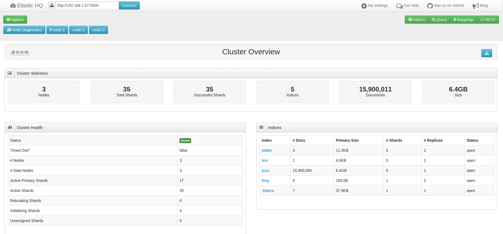
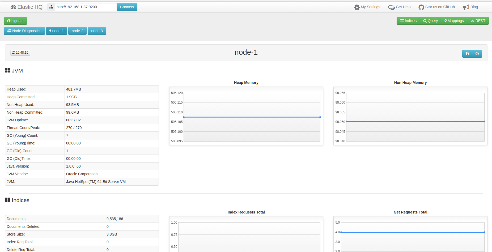
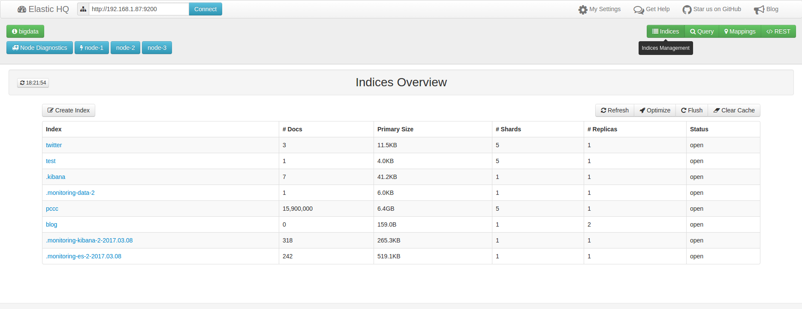
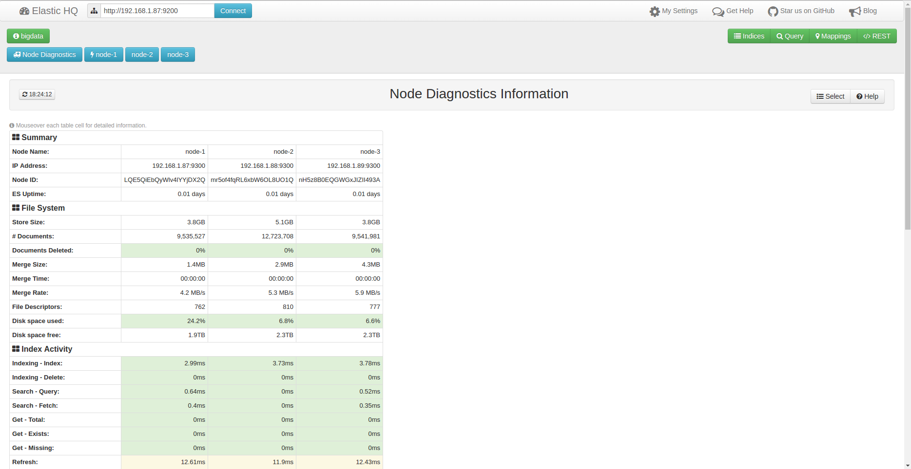
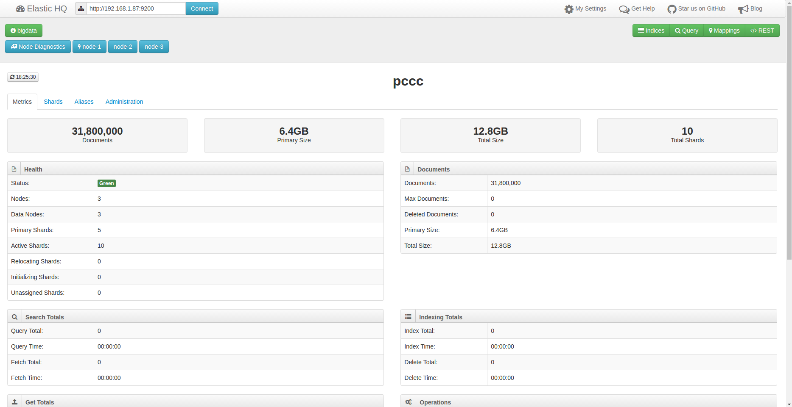
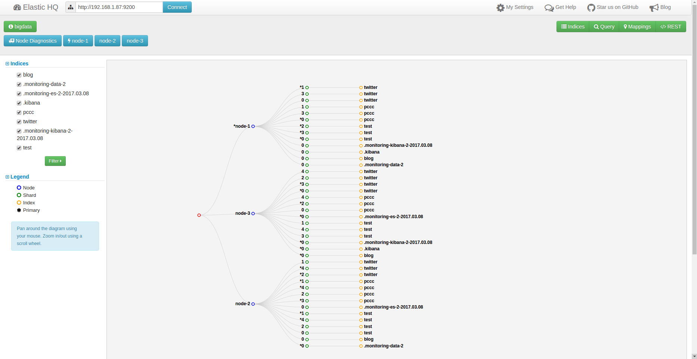
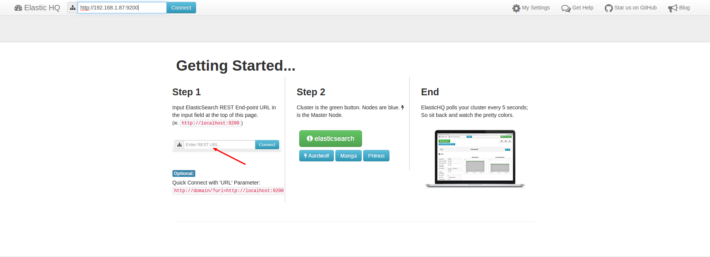

## ElasticHQ的功能介绍

`ElasticHQ`是一个具有良好体验、直观和功能强大的 ElasticSearch 的管理和监控工具。
其提供实时监控、全集群管理、搜索和查询，目前查询功能不能正常使用









### 1. 从github上clone项目

```
git clone https://github.com/royrusso/elasticsearch-HQ.git
```

### 2. 配置并启动nginx

`vi /usr/local/nginx/cong/nginx.conf`
```
# 去掉文件第一行的注释
user  es;

server {
         listen       9000;
         server_name  es-hq;
         root /home/es/elasticsearch-HQ;
    }
```

启动nginx
```
/usr/local/nginx/sbin/nginx -s stop/reload
```

在浏览器中输入`http://192.168.1.87:9000`，如下图：



### 3. 连接集群

在界面顶部填写es地址就会去连接es集群

a) 但是会报一个错误：**Unable to Read Node List!**，解决方案如下：

```
cd elasticsearch-HQ

sed s'/nodes?all=true/nodes\/_all/g' -i  js/all.min.js 
sed 's/state?filter_nodes=false&filter_metadata=true&filter_routing_table=true&filter_blocks=true&filter_indices=true/state/g' -i  js/all.min.js 
sed 's/?all=1/\/_all/g' -i  js/all.min.js
```
修改完以后重启nginx，再重新访问就不会报错了，如下图：


b) 当点击node时还是会报错：**Unable to Read Node Information!**，解决方案如下：

```
cd elasticsearch-HQ

sed s'/?all=true//g' -i  js/all.min.js
```
修改完以后重启nginx，再重新访问就不会报错了，如下图：


c) 由于HQ插件不能完美支持ES5.X，所以其中的`query`和`rest`功能不能使用