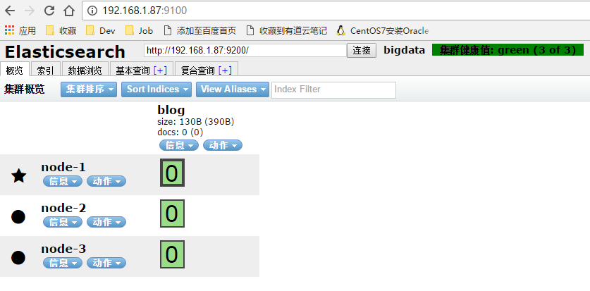

ES 5.X 和之前的版本不太一样，elasticsearch-head 做为一个单独的服务，所以就没有了 plugin install

## 安装

```
$ pwd
/home/es
$ git clone git://github.com/mobz/elasticsearch-head.git
$ cd elasticsearch-head
```

### 1. 配置

```
$ vi _site/app.js

# 修改 this.base_uri = this.config.base_uri || this.prefs.get("app-base_uri") || "http://localhost:9200";
# 这里的 localhost 是指进入elasticsearch-head页面时默认访问的ES集群地址，把她修改为其中一台ES节点的地址即可
this.base_uri = this.config.base_uri || this.prefs.get("app-base_uri") || "http://192.168.1.87:9200";
```

### 2. 配置并启动nginx

`vi /usr/local/nginx/cong/nginx.conf`
```
# 去掉文件第一行的注释
user  es;

server {
         listen       9100;
         server_name  es-head;
         root /home/es/elasticsearch-head;
    }
```

**启动nginx**
```
/usr/local/nginx/sbin/nginx -s stop/reload
```

**启动成功，可以打开 `http://192.168.1.87:9100/`**



到此 elasticsearch-head 插件安装完毕