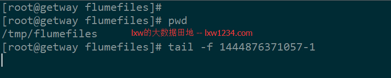
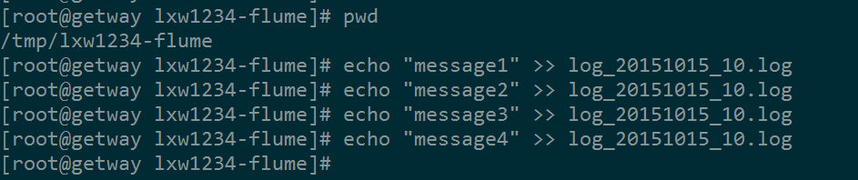
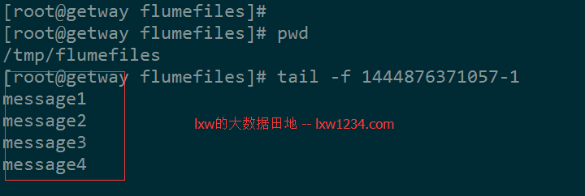
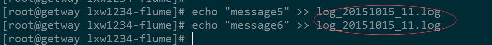
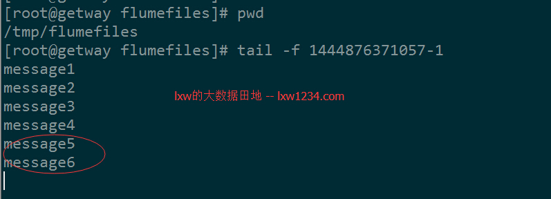
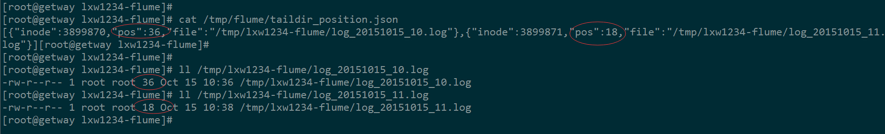

在通过Flume收集日志的业务场景中，一般都会遇到下面的情况，在日志收集服务器的某个目录下，会按照一段时间生成一个日志文件，并且日志会不断的追加到这个文件中，比如，每小时一个命名规则为log_20151015_10.log的日志文件，所有10点产生的日志都会追加到这个文件中，到了11点，就会生成另一个log_20151015_11.log的文件。

这种场景如果通过flume（<=1.6）收集，当前提供的Spooling Directory Source和Exec Source均不能满足动态实时收集的需求，但是在flume1.7版本中，提供了一个非常好用的TaildirSource，使用这个source，可以监控一个目录，并且使用正则表达式匹配该目录中的文件名进行实时收集。

我将TaildirSource的相关源码下载下来（需要做简单修改），然后集成到Flume1.6中，满足了上面提到的需求，获得了良好的效果。

源码下载地址： [点击下载](assets/flume-taildirfile-source.zip)

将源码单独编译，打成jar包，上传到$FLUME_HOME/lib/目录下。

下面的例子中，通过flume监控/tmp/lxw1234-flume/目录下，命名规则为`log_.*.log`的文件，并将文件内容实时的写入/tmp/flumefiles/目录下，
即：source为TaildirSource，sink为file_roll；

### Agent配置
agent_lxw1234的配置文件如下（$FLUME_HOME/conf/agent_lxw1234_conf.properties）：
```
#-->设置sources名称
agent_lxw1234.sources = sources1
#--> 设置channel名称
agent_lxw1234.channels = fileChannel
#--> 设置sink 名称
agent_lxw1234.sinks = sink1
# source 配置
agent_lxw1234.sources.sources1.type = com.lxw1234.flume17.TaildirSource
agent_lxw1234.sources.sources1.positionFile =/tmp/flume/taildir_position.json
agent_lxw1234.sources.sources1.filegroups = f1
agent_lxw1234.sources.sources1.filegroups.f1 =/tmp/lxw1234-flume/log_.*.log
agent_lxw1234.sources.sources1.batchSize =100
agent_lxw1234.sources.sources1.backoffSleepIncrement =1000
agent_lxw1234.sources.sources1.maxBackoffSleep =5000
agent_lxw1234.sources.sources1.channels = fileChannel
# sink1 配置
agent_lxw1234.sinks.sink1.type = file_roll
agent_lxw1234.sinks.sink1.sink.directory =/tmp/flumefiles
agent_lxw1234.sinks.sink1.sink.rollInterval =0
agent_lxw1234.sinks.sink1.channel = fileChannel
# fileChannel 配置
agent_lxw1234.channels.fileChannel.type = file
#-->检测点文件所存储的目录
agent_lxw1234.channels.fileChannel.checkpointDir =/opt/flume/checkpoint/lxw1234/
#-->数据存储所在的目录设置
agent_lxw1234.channels.fileChannel.dataDirs =/opt/flume/data/lxw1234/
#-->隧道的最大容量
agent_lxw1234.channels.fileChannel.capacity =10000
#-->事务容量的最大值设置
agent_lxw1234.channels.fileChannel.transactionCapacity =200
```

### TaildirSource的配置说明:

**filegroups**     指定filegroups，可以有多个，以空格分隔；（TailSource可以同时监控tail多个目录中的文件）

**filegroups.**     配置每个filegroup的文件绝对路径，文件名可以用正则表达式匹配

**positionFile**    配置检查点文件的路径，检查点文件会以json格式保存已经tail文件的位置

### 启动Agent
```
cd $FLUME_HOME/conf/
flume-ng agent -n agent_lxw1234 –conf . -f agent_lxw1234_conf.properties
```

### 运行结果
启动之后，在sink所指的/tmp/flumefiles目录下，生成了一个大小为0的目标文件，命令为时间戳-1，如：


接着往监控的目录中生成log_20151015_10.log的文件：


此时，在上面tail –f 目标文件的控制台中，已经可以看到写入的内容了：


再模拟生成一个新的文件（log_20151015_11.log）：


同样，目标文件中也正常写入：


如果在监控的目录/tmp/lxw1234-flume/中，产生和所配置的文件名正则表达式不匹配的文件，则不会被tail。

另外，如果将所监控目录/tmp/lxw1234-flume/中已经过期的文件移除，也不会影响agent的运行。

### 检查点文件positionFile
看一下该文件的内容：


该文件中记录了所监控的每个文件的当前位置，如图中红圈圈出的pos的值，因为两个文件都已经读到了最后，因此每个pos的值就是该文件的大小。

TailSource使用了RandomAccessFile来根据positionFile中保存的文件位置来读取文件的，在agent重启之后，亦会先从positionFile中找到上次读取的文件位置，保证内容不会重复发送。
