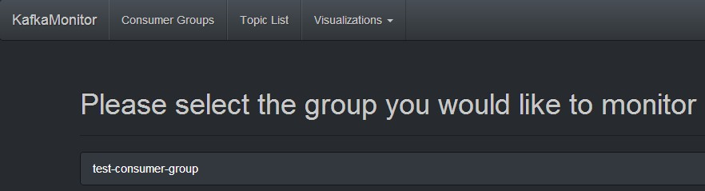

当你将Kafka集群部署之后，你可能需要知道当前消息队列的增长以及消费情况，这时候你就得需要监控它。今天我这里推荐两款Kafka开源的监控系统：KafkaOffsetMonitor和Kafka Web Console。

KafkaOffsetMonitor是用来实时监控Kafka集群的consumers以及它们在partition中的offset(偏移量)。

你可以浏览当前的消息消费者组，每个topic队列的所有partition的消费情况。这其实是很有用得，从这些监控中你可以很快地知道每个partition中的消息是否很快被消费以及相应的队列消息增长速度等信息。这些可以debug kafka的producers和consumers，你完全知道你的系统将会发生什么。

这个web管理平台保留的partition offset和consumer滞后的历史数据（具体数据保存多少天我们可以在启动的时候配置），所以你可以很轻易了解这几天consumer消费情况。

KafkaOffsetMonitor这款软件是用Scaka代码编写的，消息等历史数据是保存在名为offsetapp.db数据库文件中，该数据库是SQLLite文件，非常的轻量级。虽然我们可以在启动KafkaOffsetMonitor程序的时候指定数据更新的频率和数据保存的时间，但是不建议更新很频繁，或者保存大量的数据，因为在KafkaOffsetMonitor图形展示的时候会出现图像展示过慢，或者是直接导致内存溢出了。所有的关于消息的偏移量、kafka集群的台数等信息都是从Zookeeper中获取到的，日志大小是通过计算得到的。

可以到官网下载KafkaOffsetMonitor源码或者直接下载好编译好的文件，这里是直接下载编译好的文件：[下载](https://github.com/quantifind/KafkaOffsetMonitor/releases/)

### 启动命令
```
java -cp KafkaOffsetMonitor-assembly-0.2.1-SNAPSHOT.jar \
com.quantifind.kafka.offsetapp.OffsetGetterWeb \
--zk zk-server1,zk-server2 \
--port 8080\
--refresh 10.seconds \
--retain 2.days
```

### 各个参数的含义：
| 属性 | 含义 |
|:----:|:----:|
|zk|the ZooKeeper hosts|
|port|on what port will the app be available|
|refresh|how often should the app refresh and store a point in the DB|
|retain|how longshould points be kept in the DB|
|dbName|where to store the history (default'offsetapp')|

这样将会在8080端口上访问该监控：

