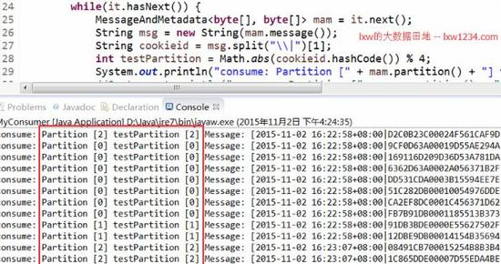

我们目前的业务场景如下：前端的5台日志收集服务器产生网站日志，使用Flume实时收集日志，并将日志发送至Kafka，然后Kafka中的日志一方面可以导入到HDFS，另一方面供实时计算模块使用。

前面的文章《 Kafka分区机制介绍与示例 》介绍过Kafka的分区机制。我们对Kafka中存储日志的Topic指定了多个分区，默认情况下，Kafka Sink在收到events之后，将会随机选择一个该Topic的分区来存储数据，但我们不想这么做，我们需要根据网站日志中的cookieid来决定events存储到哪个分区中，简单来说，就是对cookieid计算hashcode，取绝对值，然后和Topic的分区数做模运算，这样，即实现了多分区的负载均衡，又确保相同的cookieid会写入同一个分区中，这样的处理，对后续的实时计算模块大有好处（后续再介绍）。

而这样的需求，利用Flume的拦截器即可实现。前面有两篇文章

《 Flume中的拦截器（Interceptor）介绍与使用（一） 》和

《 Flume中的拦截器（Interceptor）介绍与使用（二） 》

介绍了Flume的拦截器和使用示例，这里我们使用的拦截器是Regex Extractor Interceptor。

即从原始events中抽取出cookieid，放入到header中，而Kafka Sink在写入Kafka的时候，会从header中获取指定的key，然后根据分区规则确定该条events写入哪个分区中。

### 网站日志格式

假设原始网站日志有三个字段，分别为 时间|cookieid|ip，中间以单竖线分隔，比如：
```
2015-10-30 16:00:00|967837DE00026C55D8DB2E|127.0.0.1
2015-10-30 16:05:00|967837DE00026C55D8DB2E|127.0.0.1
2015-10-30 17:10:00|AC19BBDC0002A955A4A48F|127.0.0.1
2015-10-30 17:15:00|AC19BBDC0002A955A4A48F|127.0.0.1
```

### Flume Source的配置
```
agent_lxw1234.sources = sources1
agent_lxw1234.channels = fileChannel
agent_lxw1234.sinks = sink1

##source 配置
agent_lxw1234.sources.sources1.type = com.lxw1234.flume17.TaildirSource
agent_lxw1234.sources.sources1.positionFile = /tmp/flume/agent_lxw1234_position.json
agent_lxw1234.sources.sources1.filegroups = f1
agent_lxw1234.sources.sources1.filegroups.f1 = /tmp/lxw1234_.*.log
agent_lxw1234.sources.sources1.batchSize = 100
agent_lxw1234.sources.sources1.backoffSleepIncrement = 1000
agent_lxw1234.sources.sources1.maxBackoffSleep = 5000
agent_lxw1234.sources.sources1.channels = fileChannel
```
该source用于监控`/tmp/lxw1234_.*.log命名格式的文件`

### Flume Source拦截器配置
```
## source 拦截器
agent_lxw1234.sources.sources1.interceptors = i1
agent_lxw1234.sources.sources1.interceptors.i1.type = regex_extractor
agent_lxw1234.sources.sources1.interceptors.i1.regex = .*?\\|(.*?)\\|.*
agent_lxw1234.sources.sources1.interceptors.i1.serializers = s1
agent_lxw1234.sources.sources1.interceptors.i1.serializers.s1.name = key
```
该拦截器（Regex Extractor Interceptor）用于从原始日志中抽取cookieid，访问到events header中，header名字为key。

### Flume Kafka Sink配置
```
# sink 1 配置
agent_lxw1234.sinks.sink1.type = org.apache.flume.sink.kafka.KafkaSink
agent_lxw1234.sinks.sink1.brokerList = developnode1:9091,developnode1:9092,developnode2:9091,developnode2:9092
agent_lxw1234.sinks.sink1.topic = lxw1234
agent_lxw1234.sinks.sink1.channel = fileChannel
agent_lxw1234.sinks.sink1.batch-size = 100
agent_lxw1234.sinks.sink1.requiredAcks = -1
agent_lxw1234.sinks.sink1.kafka.partitioner.class = com.lxw1234.flume17.SimplePartitioner
```
该Sink配置为Kafka Sink，将接收到的events发送至kafka集群的topic：lxw1234中。

其中topic：lxw1234创建时候指定了4个分区，Kafka Sink使用的分区规则为

com.lxw1234.flume17.SimplePartitioner，它会读取events header中的key值（即cookieid），然后对cookieid应用于分区规则，以便确定该条events发送至哪个分区中。

关于com.lxw1234.flume17.SimplePartitioner的介绍和代码，见：

《 Kafka分区机制介绍与示例 》。

## Kafka消费者

使用下面的Java程序从Kafka中消费数据，打印出每条events所在的分区。

并从events中抽取cookieid，然后根据com.lxw1234.flume17.SimplePartitioner中的分区规则（Math.abs(cookieid.hashCode()) % 4）测试分区，看是否和获取到的分区一致。
```
package com.lxw1234.kafka;

import java.util.HashMap;
import java.util.List;
import java.util.Map;
import java.util.Properties;

import kafka.consumer.Consumer;
import kafka.consumer.ConsumerConfig;
import kafka.consumer.ConsumerIterator;
import kafka.consumer.KafkaStream;
import kafka.javaapi.consumer.ConsumerConnector;
import kafka.message.MessageAndMetadata;

public class MyConsumer {
	public static void main(String[] args) {
		String topic = "lxw1234";
		ConsumerConnector consumer = Consumer.createJavaConsumerConnector(createConsumerConfig());
		Map<String, Integer> topicCountMap = new HashMap<String, Integer>();
		topicCountMap.put(topic, new Integer(1));
		Map<String, List<KafkaStream<byte[], byte[]>>> consumerMap = consumer.createMessageStreams(topicCountMap);
		KafkaStream<byte[], byte[]> stream =  consumerMap.get(topic).get(0);
		ConsumerIterator<byte[], byte[]> it = stream.iterator();
	    while(it.hasNext()) {
	    	MessageAndMetadata<byte[], byte[]> mam = it.next();
	    	String msg = new String(mam.message());
	    	String cookieid = msg.split("\\|")[1];
	    	int testPartition = Math.abs(cookieid.hashCode()) % 4;
	    	System.out.println("consume: Partition [" + mam.partition() + "] testPartition [" + testPartition + "] Message: [" + new String(mam.message()) + "] ..");
	    }

	}

	private static ConsumerConfig createConsumerConfig() {
	    Properties props = new Properties();
	    props.put("group.id","group_lxw_test");
	    props.put("zookeeper.connect","127.0.0.133:2182");
	    props.put("zookeeper.session.timeout.ms", "4000");
	    props.put("zookeeper.sync.time.ms", "200");
	    props.put("auto.commit.interval.ms", "1000");
	    props.put("auto.offset.reset", "smallest");
	    return new ConsumerConfig(props);
	  }
}
```

运行结果



如图中红框所示，实际events所在的分区和期望分区（testPartition）的结果完全一致，由此可见，所有的events已经按照既定的规则写入Kafka分区中。
