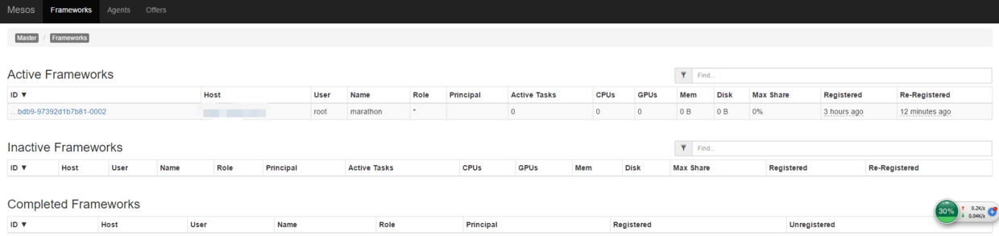
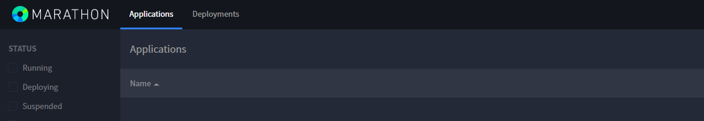

### 1. 地位

Marathon 是在Mesos上运行长期服务的框架，好比数据中心或机器的init.d，可以确保在其上运行的服务一直运行着。

### 2. Marathon安装

前提是已经安装好Mesos，见我的系列文章。

Marathon安装也有两种方式：
* [官网手动安装](http://mesosphere.github.io/marathon/docs/)；
* 使用yum安装。

这里我们使用yum的简单安装。

**Note：使用yum安装Marathon时不需要任何必要的配置，在哪个节点上安装，Marathon就会在哪个节点上启动，建议安装到master节点上**
```
sudo yum -y install marathon
```

### 3. 可选配置

其实这个设置和安装Mesos时配置mesos的hostname效果一样，不配置会显示默认的localhost，不影响使用
```
mkdir -p /etc/marathon/conf/;
touch hostname
echo 192.168.1.24 > /etc/marathon/conf/hostname
```

### 4. 启动服务
```
systemctl start marathon.service
```

在Mesos WebUI中查看Marathon的状态：





### 5. 配置

Marathon WebUI默认的端口是8080，修改端口的方法：
```
vi /etc/default/marathon

export HTTP_PORT=8181
export MARATHON_HTTP_PORT=8181
```