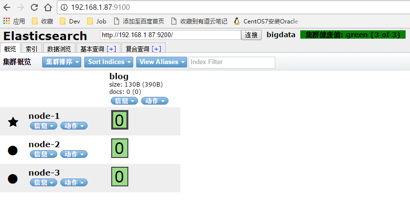

ES 5.X 和之前的版本不太一样，elasticsearch-head 做为一个单独的服务，所以就没有了 yum install

## 安装前

> 以下操作需要在普通用户（例如：spark）下操作，假如把HEAD插件安装在了`192.168.1.87`这个节点上

由于elasticsearch-head 需要nodejs，所以我们需要先安装 `nodejs` 以及 `npm`

```
$ sudo curl -sL -o /etc/yum.repos.d/khara-nodejs.repo https://copr.fedoraproject.org/coprs/khara/nodejs/repo/epel-7/khara-nodejs-epel-7.repo
$ sudo yum install -y nodejs nodejs-npm
```

## 安装

```
$ pwd
/home/spark
$ git clone git://github.com/mobz/elasticsearch-head.git
$ cd elasticsearch-head
$ npm install
```
* **配置**

```
$ vi _site/app.js

# 修改 this.base_uri = this.config.base_uri || this.prefs.get("app-base_uri") || "http://localhost:9200";
# 这里的 localhost 是指进入elasticsearch-head页面时默认访问的ES集群地址，把她修改为其中一台ES节点的地址即可
this.base_uri = this.config.base_uri || this.prefs.get("app-base_uri") || "http://192.168.1.87:9200";
```

## 启动

```
$ ./node_modules/grunt/bin/grunt server &
```
**启动成功，可以打开 `http://192.168.1.87:9100/`**




到此 elasticsearch-head 插件安装完毕